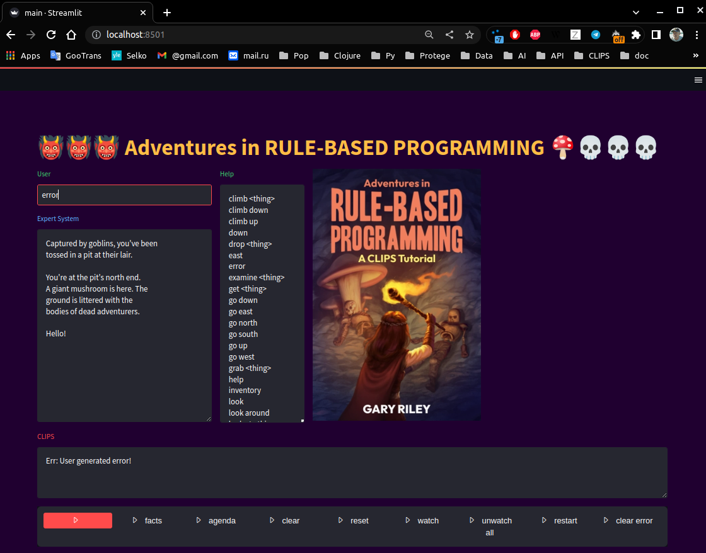

# CLIPSAdvent
User interface  for Adventures in RULE-BASED PROGRAMMING of Gary Riley on a base of Streamlit.

[](https://www.youtube.com/watch?v=OICbo3Zu_jY)
Click the screenshot to see a video!

This program adds web interface to a CLIPS application described in [Adventures in RULE-BASED PROGRAMMING, of Gary Riley](https://clipsrules.net/airbp.html). With it, you can decorate and enliven slightly text adventures by images, audio and video materials.
The program written on Python programming language and use following libraries.
## Libraries
- streamlit [https://streamlit.io/](https://streamlit.io/) - Python web interface library
- clipspy [https://github.com/noxdafox/clipspy](https://github.com/noxdafox/clipspy) - CLIPS Python bindings
- pillow [https://github.com/python-pillow/Pillow](https://github.com/python-pillow/Pillow) - Python Imaging Library
- streamlit-option-menu [https://github.com/victoryhb/streamlit-option-menu](https://github.com/victoryhb/streamlit-option-menu) - Streamlit component
## Start
Change directory to this application folder and in a terminal execute a coomand:
```bush
streamlit run main.py
```
or
```bush
python -m streamlit run main.py
```
## For newbies
The easiest way to install Python, libraries and start developing is to install Thonny [https://thonny.org/](https://thonny.org/).

Libraries installation in Thonny: Menu Tools > Manage Packages > Search on PyPI > library name

 Start in Thonny Shell:
```bush
!streamlit run main.py
```  
## Feedback
For comments and suggestions please contact [Ru](https://github.com/rururu)

